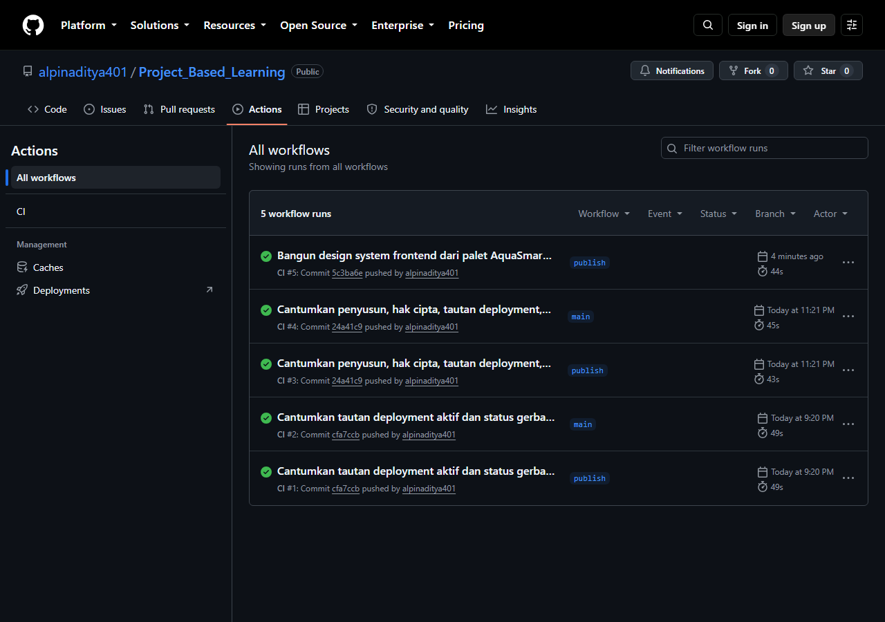

# AquaSmart AIoT

Sistem pemantauan kualitas air untuk akuakultur: pH, suhu, dan kekeruhan.

## Penyusun

Proyek Akhir Praktikum Pemrograman Front-End, tahun akademik 2026.
Program Studi D3 Teknik Informatika, Kampus Kabupaten Madiun,
Sekolah Vokasi, Universitas Sebelas Maret.

| Nama | NIM |
| --- | --- |
| Alpin Aditya Pratama | V3925004 |
| Dimas Aryo Sejati | V3925022 |

Dosen pembimbing: Darmawan Lahru Riatma, S.Kom., M.MT.

## Hak cipta

Hak cipta (c) 2026 Alpin Aditya Pratama dan Dimas Aryo Sejati. Seluruh hak
dilindungi. Ketentuan lengkapnya ada di [LICENSE](LICENSE).

Repositori ini publik semata-mata supaya penilai dapat memeriksa kode sumbernya.
Sifat publik itu bukan izin penggunaan. Mengumpulkan karya ini atau turunannya
sebagai karya sendiri adalah plagiarisme akademik. Riwayat commit Git di
repositori ini mencatat tanggal, penulis, dan isi setiap perubahan, sehingga
urutan pengerjaannya dapat diverifikasi secara independen.

## Status

Aplikasi web berjalan dan teruji secara lokal. Yang perlu dibaca apa adanya:

- **Kontrol aerator dan pemberi pakan masih SIMULASI.** Perintah tersimpan,
  berpindah status, dan tercatat di audit log, tetapi belum ada bukti aktuasi
  perangkat fisik. Respons API hardware selalu memuat
  `physical_actuation_verified=false`.
- **Pembacaan sensor belum terkalibrasi.** Label `simulation=false` adalah
  deklarasi pengirim, bukan bukti sensor fisik. Sensor pH yang ada berstatus
  placeholder tanah, bukan pH air terkalibrasi.
- **Profil FPS perangkat fisik dan audit WCAG menyeluruh belum dijalankan.**
- Kontrak menyebut MySQL/MariaDB, kode memakai SQLite. Perbedaan ini diajukan
  lewat Change Request, bukan ditutupi.

## Isi repo

| Jalur | Isi |
| --- | --- |
| `01_AquaSmart/01_Aplikasi-Web/server/` | REST API PHP 8 tanpa dependency, SQLite, 104 test |
| `01_AquaSmart/01_Aplikasi-Web/web/` | SPA/PWA JavaScript native, tanpa build step |
| `01_AquaSmart/01_Aplikasi-Web/deploy/` | Dockerfile Apache dan mod_php untuk backend |
| `01_AquaSmart/01_Aplikasi-Web/firmware/` | Sketsa ESP32 |
| `01_AquaSmart/01_Aplikasi-Web/docs/` | Catatan perhitungan dan rujukan SKPL |
| `frontend/` | Frontend Next.js 16 App Router: 10 rute, BFF ke backend PHP, design system |

Struktur folder sengaja dipertahankan seperti di ruang kerja aslinya supaya
perintah pada dokumen dan jalur di dalam test tetap berlaku tanpa penyesuaian.

## Deployment aktif

| Bagian | Tautan | Diperiksa |
| --- | --- | --- |
| Frontend Next.js | https://frontend-kappa-steel-78.vercel.app | 21 September 2026, HTTP 200 |
| Backend PHP (REST) | https://projectbasedlearning-production.up.railway.app | 21 September 2026, `GET /api/rules` HTTP 200 |

**Yang tayang di Vercel masih build lama.** Diperiksa 21 September 2026: halaman
depan yang dilayani tautan di atas masih memuat kalimat "Halaman dan lapisan data
belum dikerjakan", yaitu kerangka sebelum sepuluh rute aplikasi ditulis. Kode
terbarunya ada di repositori dan lulus CI, tetapi Vercel belum di-deploy ulang.
Jangan menilai kelengkapan fitur dari tautan itu sebelum deploy ulang dilakukan.

Frontend berjalan di Vercel, backend di Railway. URL per-deployment Vercel berada
di balik Deployment Protection; yang di atas adalah URL produksi yang terbuka.

`GET /api/rules` adalah satu-satunya endpoint yang memasang
`Access-Control-Allow-Origin: *`. Endpoint lain butuh cookie sesi dan tidak
boleh dipanggil lintas origin.

## Gerbang kualitas kode

`.github/workflows/ci.yml` menjalankan lint Biome, pemeriksaan tipe, test, dan
build untuk `frontend/` dan `02_Praktikum-Frontend/modul-8/` pada setiap push dan
pull request. Job SonarQube berjalan hanya kalau secret `SONAR_TOKEN` sudah
dipasang; tanpa itu langkahnya dilewati dengan pesan, bukan gagal.

Gerbang yang benar-benar punya bukti adalah CI GitHub Actions. Lima kali
dijalankan, seluruhnya hijau, termasuk pada commit terakhir `5c3ba6e`:



Konfigurasi pemindaian ada di `sonar-project.properties`. **Pemindaian SonarQube
Cloud belum pernah dijalankan pada repo ini**, jadi status Quality Gate SonarQube
belum punya bukti dan tidak diklaim lulus. Tangkapan layar di atas adalah gerbang
CI, bukan Quality Gate SonarQube; keduanya tidak boleh ditukar saat dibaca.

## Menjalankan secara lokal

Butuh PHP 8.2 atau lebih baru dan Python 3.11. Dari `01_AquaSmart/01_Aplikasi-Web`:

```bash
python server/run_local.py
```

Aplikasi terbuka di `http://127.0.0.1:8080`. Kredensial runtime, seed, dan kunci
per-perangkat dijelaskan di `LOCAL_GUIDE.md`.

## Gerbang verifikasi

Dari `01_AquaSmart/01_Aplikasi-Web`:

```bash
python server/tests/run_verified_suite.py
```

Lulus berarti keluaran JSON-nya memuat `"passed": true` dengan `failures`,
`errors`, dan `skipped` bernilai nol, serta `tests_run` sama dengan
`planned_tests`. Runner ini juga menjalankan `php -l` pada seluruh berkas PHP.

Frontend Next.js diperiksa dari `frontend/`:

```bash
npm install && npm run build
```

## Kesesuaian kontrak dan SKPL

| Dokumen | Isi |
| --- | --- |
| [Ceklist kesesuaian](01_AquaSmart/01_Aplikasi-Web/docs/CEKLIST_KESESUAIAN_KONTRAK_SKPL.md) | D-01 sampai D-05, FR1 sampai FR24, dan NFR1 sampai NFR15 dipetakan ke status dan bukti di kode |
| [Change Request CR-001](01_AquaSmart/01_Aplikasi-Web/docs/CR-001_Basis_Data_SQLite.md) | Basis data deployment v1 memakai SQLite, diajukan ke sponsor dan menunggu keputusan |
| `docs/Laporan_Kesesuaian_Kontrak_dan_SKPL_AquaSmart.docx` | Kedua dokumen di atas dalam satu berkas siap kumpul |

Hasil penilaian 21 September 2026 pada commit `5c3ba6e`: dari 44 butir, 8
terpenuhi, 33 terpenuhi sebagian, 3 tidak dapat diverifikasi, dan tidak ada yang
berstatus tidak terpenuhi. Butir yang tidak dapat diverifikasi adalah D-04
prototipe hardware-edge, NFR2 uptime, dan NFR3 akurasi sensor; ketiganya
memerlukan perangkat fisik atau jendela pengamatan yang tidak ada di repositori.

## Dokumen

`DESIGN.md` adalah catatan keputusan desain yang mengikat, bukan draft.
`server/API.md` adalah sumber kebenaran kontrak API. `REVIEW_REPORT.md` dan
`CHECKPOINT.md` memuat status dan bukti terbaru.

## Catatan publikasi

Repo ini adalah bagian deliverable dari ruang kerja yang lebih besar. Materi
kursus pihak ketiga, modul praktikum milik kampus, dan dokumen yang memuat data
pribadi orang lain tidak disertakan.
